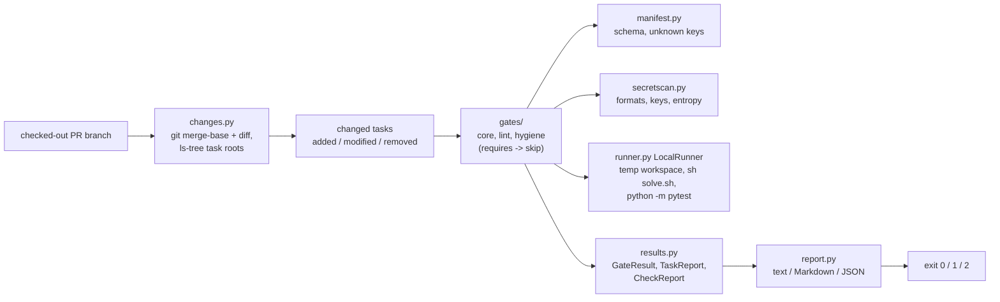

# TaskGate

[](https://github.com/vipul21435/taskgate/actions/workflows/ci.yml)

Review gates for pull requests that add or change benchmark tasks for AI coding
agents. TaskGate finds the task directories a pull request touches, runs each
one through a set of gates with stable codes (layout, manifest schema and lint,
secrets, file sizes and binaries, the reference solution must pass, an untouched
workspace must fail), and reports the result as terminal text, a Markdown
pull-request summary and JSON, with a non-zero exit when a blocking gate fails.

It mirrors the submission side of benchmark-task work at an AI-data company:
every task has to clear the same review gates before it is accepted, and a
grader that passes when the agent did nothing is the most common way a task
goes wrong.

## What works today

- **`taskgate check`** diffs the checked-out branch against its merge base with
  `--base` (default `origin/main`, falling back to `main`), maps every changed
  path to the task directory that owns it, labels each task `added`, `modified`
  or `removed`, and runs the gates on every task that still exists. `--all`
  checks every task under a directory instead (no git needed).
- **Ten gates**, run in code order; a gate whose prerequisite did not pass, or
  whose input is missing, is reported as `skip` rather than as a second failure:

  | Code | Name | Default | Passes when |
  | --- | --- | --- | --- |
  | TG101 | layout-complete | error | `task.toml`, `instruction.md`, `environment/`, `solution/solve.sh` and a `tests/test_*.py` exist |
  | TG102 | manifest-valid | error | `task.toml` parses; `id` is kebab-case and equals the directory name; `difficulty`, `timeout_sec` (1..3600), `workdir` are valid; every problem is listed at once |
  | TG103 | manifest-known-keys | warning | no table or key outside the schema; each unknown one gets a did-you-mean hint with the qualified name |
  | TG104 | timeout-in-range | warning | `timeout_sec` is inside the recommended range (10..1800 s unless `[manifest]` says otherwise) |
  | TG105 | instruction-not-empty | error | `instruction.md` is UTF-8 and has text beyond headings and HTML comments |
  | TG201 | no-secrets | error | no text file holds a known token format (cloud key ids, source-host, chat, payment and `sk-` API keys, JSON web tokens), a private key header or a high-entropy string |
  | TG202 | file-size-limits | error | every file is under 1 MiB and the task under 10 MiB (`[files]`) |
  | TG203 | no-binary-files | error | every binary file (NUL in the first 8000 bytes) matches a `[files] binary_allow` glob |
  | TG401 | solution-passes | error | `solve.sh` exits 0 and the pytest grader then passes (needs TG101) |
  | TG402 | baseline-fails | error | the grader fails on the untouched workspace and collects at least one test (needs TG101) |

  Only `error` failures block. The full task layout, runtime contract and gate
  rules are in [docs/task-layout.md](docs/task-layout.md).
- **A secret scanner** (`secretscan.py`) that streams every text file line by
  line and never prints more than the first four characters of a match. Its
  high-entropy rule needs mixed case and digits, at least 4.0 bits per
  character, frequent character-class changes, and fewer than 15% common
  English bigrams, the last of which keeps long identifiers such as
  `PyUnicode_AsLatin1String` out. URLs and `sha256=`/`sha512-` digests are
  blanked first. A `taskgate: allow-secret` comment, `[secrets] allow` regexes
  and `exclude` globs handle false positives.
- **A local runner** that copies `environment/workspace/`, `solution/` and
  `tests/` into a fresh temporary directory, runs `sh solve.sh` and then
  `python -m pytest` there under the task's `timeout_sec` budget (killing the
  whole process group on timeout), and never writes into the task's source tree.
- **Reports**: text on stdout (or `--format markdown|json`), plus `report.md` and
  `report.json` under `--out DIR`. Exit codes: 0 no blocking failure, 1 blocking
  failure, 2 usage error (not a git repository, unknown base ref, invalid
  `taskgate.toml`).
- **A sample repository builder** (`examples/build_sample_repo.py`) that creates
  a git repository with a `main` branch and two pull-request branches, one with a
  good task and one with a flawed task. Commits use fixed authors and dates, so
  the merge base (`b26918e`) and every report are identical on macOS and in the
  Linux container.
- **A gate registry.** Every gate satisfies one `Gate` protocol (code, name,
  severity, summary, fix hint, `requires`, `check(ctx)`); `taskgate gates`
  lists every code grouped by hundreds. Third-party gates register through the
  `taskgate.gates` entry-point group and must use TG7xx-TG9xx;
  [examples/plugin](examples/plugin) is a working example (TG701). A plugin that
  fails to load or breaks the contract stops the run with exit code 2, and a gate
  that raises is reported as a failure instead of hiding the other results.
- **`taskgate.toml`** turns gates off (`[gates] disable = [...]`), changes their
  severity (`[gates.severity] TG402 = "warning"`) and tunes the static gates:

  ```toml
  [manifest]                  # TG104
  min_timeout_sec = 10
  max_timeout_sec = 1800

  [secrets]                   # TG201
  allow = ["^EXAMPLE"]        # regexes on the matched text
  exclude = ["tests/data/*"]  # task-relative path globs, not scanned
  min_length = 24
  entropy_threshold = 4.0

  [files]                     # TG202, TG203
  max_file_bytes = 1048576
  max_task_bytes = 10485760
  binary_allow = ["environment/workspace/*.png"]
  ```

  Unknown sections, keys, gate codes, bad values and invalid regexes are errors
  (exit 2), all listed at once. In diff mode the file is read from the base ref
  (`git show main:taskgate.toml`), so a pull request cannot relax the gates that
  check it; `--config PATH` overrides that. Reports name the config source, every
  override and every option that differs from its default (`config: taskgate.toml;
  options manifest.max_timeout_sec=60, files.max_file_bytes=1024`).
- `taskgate tasks [ROOT]` lists task directories and the layout parts each lacks.
- A digest-pinned Docker image (non-root user, git included) that runs the CLI
  and the demo, and GitHub Actions CI that runs lint, mypy, the tests with a
  coverage gate, the demo, and the demo again inside the built image.

## Quickstart

```sh
git clone https://github.com/vipul21435/taskgate && cd taskgate
uv sync --locked
make demo
uv run taskgate check --all examples/sample-repo
```

Verified from a fresh clone. `make demo` needs no network, Docker or tokens and
took 1.1 s (`time make demo`, 1.10 to 1.16 s over three runs on an 8 GB M-series
Mac). The last
command exits 1 on purpose: the bundled draft task is incomplete.

## Usage

```
taskgate check [REPO] [--base REF] [--all] [--out DIR] [--format text|markdown|json] [--config FILE]
taskgate gates [ROOT] [--json] [--config FILE]
taskgate tasks [ROOT] [--json] [--strict]
taskgate version
```

`make demo` builds the sample repository, checks out each pull-request branch
and runs `taskgate check <repo> --base main --out <dir>`. On the good branch:

```
taskgate 0.1.0: diff against main (merge base b26918e), 1 changed task, 1 other file
tasks/integer-determinant  added  PASS
  pass  TG101  layout-complete        layout complete
  pass  TG102  manifest-valid         manifest valid
  pass  TG103  manifest-known-keys    no unknown keys
  pass  TG104  timeout-in-range       task.timeout_sec 120 is within 10..1800
  pass  TG105  instruction-not-empty  instruction.md has 90 words
  pass  TG201  no-secrets             no secrets in 6 text files
  pass  TG202  file-size-limits       6 files, 3.5 KiB in total
  pass  TG203  no-binary-files        no binary files
  pass  TG401  solution-passes        reference solution passes the grader (3 passed)
  pass  TG402  baseline-fails         an untouched workspace fails the grader (3 failed)
result: PASS, 0 blocking failures
```

On the bad branch, whose grader calls `pytest.skip` when the output file is
missing, whose manifest says `difficulty = "trivial"`, and whose `solve.sh`
exports a leftover API key (a planted random string, exit code 1):

```
taskgate 0.1.0: diff against main (merge base b26918e), 1 changed task
tasks/word-count  added  FAIL
  pass  TG101  layout-complete        layout complete
  FAIL  TG102  manifest-valid         task.difficulty 'trivial' is not one of easy, medium, hard
        fix: Fix task.toml to match the manifest schema in docs/task-layout.md.
  pass  TG103  manifest-known-keys    no unknown keys
  pass  TG104  timeout-in-range       task.timeout_sec 60 is within 10..1800
  pass  TG105  instruction-not-empty  instruction.md has 67 words
  FAIL  TG201  no-secrets             1 likely secret: solution/solve.sh:7 high-entropy string 'huG8...' (32 chars)
        fix: Remove the credential and rotate it, since it has been pushed. For a false positive, add 'taskgate: allow-secret' to the line, or an allow regex or exclude glob under [secrets] in taskgate.toml.
  pass  TG202  file-size-limits       6 files, 2.4 KiB in total
  pass  TG203  no-binary-files        no binary files
  pass  TG401  solution-passes        reference solution passes the grader (2 passed)
  FAIL  TG402  baseline-fails         the grader passes an untouched workspace (2 skipped)
        fix: Make the grader assert on the output the instruction asks for, so a workspace where nothing was done cannot pass (no skips or early returns).
result: FAIL, 3 blocking failures
```

The `report.md` written for that branch, ready to post as a pull-request comment:

```markdown
## TaskGate: FAIL

3 blocking failures; diff against main (merge base b26918e), 1 changed task.

| Task | Change | Verdict | Blocking gates |
| --- | --- | --- | --- |
| `tasks/word-count` | added | **fail** | TG102, TG201, TG402 |

### `tasks/word-count`

| Gate | Status | Message |
| --- | --- | --- |
| TG101 layout-complete | pass | layout complete |
| TG102 manifest-valid | **fail** (error) | task.difficulty 'trivial' is not one of easy, medium, hard |
| TG103 manifest-known-keys | pass | no unknown keys |
| TG104 timeout-in-range | pass | task.timeout_sec 60 is within 10..1800 |
| TG105 instruction-not-empty | pass | instruction.md has 67 words |
| TG201 no-secrets | **fail** (error) | 1 likely secret: solution/solve.sh:7 high-entropy string 'huG8...' (32 chars) |
| TG202 file-size-limits | pass | 6 files, 2.4 KiB in total |
| TG203 no-binary-files | pass | no binary files |
| TG401 solution-passes | pass | reference solution passes the grader (2 passed) |
| TG402 baseline-fails | **fail** (error) | the grader passes an untouched workspace (2 skipped) |

How to fix:

- **TG102**: Fix task.toml to match the manifest schema in docs/task-layout.md.
- **TG201**: Remove the credential and rotate it, since it has been pushed. For a false positive, add 'taskgate: allow-secret' to the line, or an allow regex or exclude glob under [secrets] in taskgate.toml.
- **TG402**: Make the grader assert on the output the instruction asks for, so a workspace where nothing was done cannot pass (no skips or early returns).

<sub>taskgate 0.1.0</sub>
```

Manifest lint on a copy of the accepted sample task with two typos
(`timout_sec`, `[enviroment]`), checked with `taskgate check --all DIR`. TG102
reports what is missing, TG103 names the probable typo, TG104 skips because the
timeout is unusable, and the warning does not add to the blocking count:

```
modular-inverse  FAIL
  pass  TG101  layout-complete        layout complete
  FAIL  TG102  manifest-valid         missing [environment] table; missing task.timeout_sec; missing environment.dockerfile; missing environment.workdir
        fix: Fix task.toml to match the manifest schema in docs/task-layout.md.
  fail  TG103  manifest-known-keys    unknown in task.toml: task.timout_sec (did you mean task.timeout_sec?), [enviroment] (did you mean [environment]?)
        fix: Rename or remove the unknown keys; every key task.toml may hold is listed in docs/task-layout.md.
  skip  TG104  timeout-in-range       task.timeout_sec is missing or invalid (see TG102)
  pass  TG105  instruction-not-empty  instruction.md has 109 words
  ...
result: FAIL, 1 blocking failure
```

`taskgate gates` lists every code with its effective severity:

```
TG1xx  layout and manifest
  TG101  error    layout-complete        task.toml, instruction.md, environment/, solution/solve.sh and tests/test_*.py
  TG102  error    manifest-valid         task.toml parses and has every required key with a valid value
  TG103  warning  manifest-known-keys    task.toml has no unknown tables or keys (likely typos)
  TG104  warning  timeout-in-range       task.timeout_sec is inside the recommended range (default 10..1800 s)
  TG105  error    instruction-not-empty  instruction.md is UTF-8 and has text beyond headings and comments
TG2xx  hygiene
  TG201  error    no-secrets             no credentials: known token formats, private keys or high-entropy strings
  TG202  error    file-size-limits       every file and the task as a whole stay under the size limits (1 MiB, 10 MiB)
  TG203  error    no-binary-files        no binary files unless [files] binary_allow lists them
TG4xx  solution and baselines
  TG401  error    solution-passes        the reference solution passes the grader in a fresh workspace
  TG402  error    baseline-fails         the grader fails when no solution has run (untouched workspace)
10 gates: 10 built-in, 0 from plugins
```

`report.json` carries the same data plus the full merge-base hash, each task's
changed files and a `blocking` flag per gate. CI appends both demo reports to the
job summary.

## Architecture



| Module | Role |
| --- | --- |
| `layout.py` | task discovery on disk (`task.toml` marks a task; outermost wins; hidden and tool dirs skipped) |
| `changes.py` | changed-task discovery from git, using the same task rules on `git ls-tree` of both refs |
| `manifest.py` | `task.toml` parsing, schema validation that collects every problem, unknown keys with did-you-mean hints |
| `runner.py` | the `Runner` protocol and the local subprocess runner |
| `gates/` | the `Gate` protocol, `TaskContext` and `@gate` (`base.py`); layout, manifest and runtime gates (`core.py`); manifest and instruction lint (`lint.py`); secrets, sizes and binaries (`hygiene.py`) |
| `secretscan.py` | the credential detectors behind TG201, with redacted findings |
| `config.py` | `taskgate.toml` parsing and validation (every problem at once): gates, `[manifest]`, `[secrets]`, `[files]` |
| `registry.py` | built-in plus entry-point gates, validated and sorted by code |
| `engine.py` | `run_gates`: runs gates in code order, skips unmet `requires`, contains gate crashes |
| `report.py` | pure renderers from a `CheckReport` to text, Markdown and JSON |
| `cli.py` | Typer commands `check`, `gates`, `tasks`, `version` |

## Measured

| What | Command | Result |
| --- | --- | --- |
| Tests and coverage | `make cov` | 216 passed; 100% line and branch coverage of `src/` (1278 statements, 314 branches); gate is 90% |
| Demo wall time | `time make demo` | 1.10 to 1.16 s over three runs |
| Demo in the image | `time docker run --rm --entrypoint sh taskgate:local examples/demo.sh /tmp/taskgate-demo` | 1.26 s |
| Image size | `docker image ls taskgate` | 472 MB (python:3.12-slim plus git) |
| Reports, macOS vs image | `cmp` of each demo `report.md` and `report.json` | byte-identical |
| Secret-scan false positives | `uv run python examples/secret_survey.py scan .venv/lib/python3.12/site-packages` | 0 findings in 2523 text files, 689,539 lines of the locked dependencies (macOS arm64), 4.3 s |
| Secret-scan recall | `uv run python examples/secret_survey.py recall` | 2000 seeded random base64 tokens per length: 24 chars 0.8905, 32 chars 0.9665, 40 chars 0.9720, 64 chars 0.9975 |
| Secret scan on the samples | `uv run python examples/secret_survey.py scan examples` | 1 finding: the key planted in the bad demo pull request |

## Design decisions

- **Three-dot diff.** Changes are taken from the merge base of the base ref and
  `HEAD`, so commits that land on `main` after the branch forked are never
  attributed to the pull request. Renames are split (`--no-renames`) into a
  removed task and an added task, so the new location is always checked.
- **One task rule everywhere.** A task is the outermost directory holding
  `task.toml`, outside hidden and tool directories. The disk scan and the git
  scan (`git ls-tree` on both refs) apply the same rule, so `tasks` and `check`
  never disagree about what a task is.
- **Skip, do not cascade.** Runtime gates require TG101; when the layout is
  broken they report `skip` with the reason instead of a confusing crash.
  Manifest problems (TG102) do not skip the runtime gates, so an author sees
  every real problem in one run. The lint gates skip themselves when the file
  they lint is missing or does not parse (TG101 and TG102 already say so), and
  a warning-level lint failure never blocks.
- **Secrets are never echoed.** TG201 findings carry the path, line, detector
  and only the first four characters, so a report posted to a pull request does
  not republish the credential. Test fixtures build their fake tokens at runtime
  so no token literal sits in this repository; the one planted in the demo is a
  random string with no known format.
- **Baseline means untouched.** TG402 runs the grader with no solution at all.
  pytest exit code 5 (no tests collected) fails the gate too, since a grader
  with no tests passes nothing and rejects nothing.
- **Hermetic local runs.** The runner works on copies in a temporary directory,
  writes an empty `pytest.ini` there so the surrounding repository's pytest
  config cannot leak in, drops `PYTEST_*` and coverage variables, sets
  `PYTHONHASHSEED=0`, and runs the grader with TaskGate's own interpreter
  (pytest is a runtime dependency for that reason).
- **Byte-stable reports.** Reports hold no timings (pytest durations are stripped
  from summaries) and no absolute paths, and the demo repository has fixed
  commit metadata; a test checks that two independent builds produce identical
  output.
- **Fresh repository, MIT.** No existing permissively licensed project was small
  and close enough to build on (see [PLAN.md](PLAN.md)).

## Known issues

- The local runner is not a sandbox: `solve.sh` and the grader run as the
  current user with network and filesystem access. The Docker runner with
  `--network none` and resource limits is planned (slice 2).
- `environment/Dockerfile` is not built or used yet, so a grader that needs
  packages beyond TaskGate's own environment (Python 3.12, pytest) fails TG401
  locally.
- The diff is taken from committed `HEAD`, while gates read the working tree;
  uncommitted edits are checked only if they sit inside a task the commits
  already touch.
- Gates run sequentially and nothing is cached yet; every run re-executes every
  changed task.
- The high-entropy detector trades recall for precision: it misses about 11% of
  random 24-character tokens and 3% of 32- to 40-character ones (see Measured),
  never flags a token without both letter cases and a digit, and does not look
  inside URLs, so a random token in a query string is found only when it has a
  known format.
- TG103 knows only the keys in the manifest schema; a task format that needs
  extra keys has to disable it or live with warnings until the schema grows.
- Timeouts use POSIX process groups, so the runner does not support Windows.

## Roadmap

Planned in [PLAN.md](PLAN.md). Slice 1 (the gate registry, plugins,
`taskgate.toml` and the static gates) is built (see above); the rest is not built
yet:

1. A Docker runner that builds `environment/Dockerfile` and runs with no
   network and resource limits, with the local runner as the fallback; gates for
   the build (TG301), digest-pinned `FROM` lines (TG302) and a stub solution
   (TG403).
2. Grader determinism over N reruns with shuffled test order and varied seeds
   (TG501), with the flaky tests and the seeds that flip them in the report.
3. A content-hash result cache so unchanged tasks are skipped on re-runs.
4. GitHub reporting: pull-request comment upsert, check-run annotations, JUnit
   XML, a fake GitHub API for tests and the demo, and a composite `action.yml`.

## Development

| Command | What it runs |
| --- | --- |
| `make install` | `uv sync --locked` and the pre-commit hook |
| `make lint` | `ruff check` and `ruff format --check` |
| `make typecheck` | `mypy --strict` on `src/` |
| `make test` / `make cov` | pytest, and pytest with the 90% branch-coverage gate |
| `make demo` | the offline end-to-end demo described above |
| `make docker` | build the image, run the demo in it, prune this project's dangling images |
| `uv run python examples/secret_survey.py scan DIR` / `recall` | the secret-scan false-positive and recall measurements above |

## License

MIT, see [LICENSE](LICENSE).
