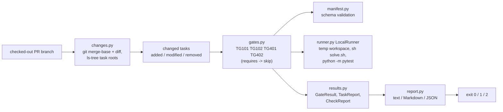

# TaskGate

[](https://github.com/vipul21435/taskgate/actions/workflows/ci.yml)

Review gates for pull requests that add or change benchmark tasks for AI coding
agents. TaskGate finds the task directories a pull request touches, runs each
one through a set of gates with stable codes (layout, manifest schema, the
reference solution must pass, an untouched workspace must fail), and reports
the result as terminal text, a Markdown pull-request summary and JSON, with a
non-zero exit when a blocking gate fails.

It mirrors the submission side of benchmark-task work at an AI-data company:
every task has to clear the same review gates before it is accepted, and a
grader that passes when the agent did nothing is the most common way a task
goes wrong.

## What works today

- **`taskgate check`** diffs the checked-out branch against its merge base with
  `--base` (default `origin/main`, falling back to `main`), maps every changed
  path to the task directory that owns it, labels each task `added`, `modified`
  or `removed`, and runs the gates on every task that still exists. `--all`
  checks every task under a directory instead (no git needed).
- **Four gates**, run in order; a gate whose prerequisite did not pass is
  reported as `skip` rather than as a second failure:

  | Code | Name | Passes when |
  | --- | --- | --- |
  | TG101 | layout-complete | `task.toml`, `instruction.md`, `environment/`, `solution/solve.sh` and a `tests/test_*.py` exist |
  | TG102 | manifest-valid | `task.toml` parses; `id` is kebab-case and equals the directory name; `difficulty`, `timeout_sec` (1..3600), `workdir` are valid; every problem is listed at once |
  | TG401 | solution-passes | `solve.sh` exits 0 and the pytest grader then passes (needs TG101) |
  | TG402 | baseline-fails | the grader fails on the untouched workspace and collects at least one test (needs TG101) |

  All four have severity `error`, so each one blocks. The full task layout and
  runtime contract are in [docs/task-layout.md](docs/task-layout.md).
- **A local runner** that copies `environment/workspace/`, `solution/` and
  `tests/` into a fresh temporary directory, runs `sh solve.sh` and then
  `python -m pytest` there under the task's `timeout_sec` budget (killing the
  whole process group on timeout), and never writes into the task's source tree.
- **Reports**: text on stdout (or `--format markdown|json`), plus `report.md` and
  `report.json` under `--out DIR`. Exit codes: 0 no blocking failure, 1 blocking
  failure, 2 usage error (not a git repository, unknown base ref).
- **A sample repository builder** (`examples/build_sample_repo.py`) that creates
  a git repository with a `main` branch and two pull-request branches, one with a
  good task and one with a flawed task. Commits use fixed authors and dates, so
  the merge base (`b26918e`) and every report are identical on macOS and in the
  Linux container.
- **A gate registry.** Every gate satisfies one `Gate` protocol (code, name,
  severity, summary, fix hint, `requires`, `check(ctx)`); `taskgate gates`
  lists every code grouped by hundreds. Third-party gates register through the
  `taskgate.gates` entry-point group and must use TG7xx-TG9xx;
  [examples/plugin](examples/plugin) is a working example (TG701). A plugin that
  fails to load or breaks the contract stops the run with exit code 2, and a gate
  that raises is reported as a failure instead of hiding the other results.
- **`taskgate.toml`** turns gates off (`[gates] disable = [...]`) or changes their
  severity (`[gates.severity] TG402 = "warning"`). Unknown sections, keys and gate
  codes are errors (exit 2). In diff mode the file is read from the base ref
  (`git show main:taskgate.toml`), so a pull request cannot relax the gates that
  check it; `--config PATH` overrides that. Reports name the config source and
  every override.
- `taskgate tasks [ROOT]` lists task directories and the layout parts each lacks.
- A digest-pinned Docker image (non-root user, git included) that runs the CLI
  and the demo, and GitHub Actions CI that runs lint, mypy, the tests with a
  coverage gate, the demo, and the demo again inside the built image.

## Quickstart

```sh
git clone https://github.com/vipul21435/taskgate && cd taskgate
uv sync --locked
make demo
uv run taskgate check --all examples/sample-repo
```

Verified from a fresh clone. `make demo` needs no network, Docker or tokens and
took 1.1 s (`time make demo`, 1.140 s total on an 8 GB M-series Mac). The last
command exits 1 on purpose: the bundled draft task is incomplete.

## Usage

```
taskgate check [REPO] [--base REF] [--all] [--out DIR] [--format text|markdown|json] [--config FILE]
taskgate gates [ROOT] [--json] [--config FILE]
taskgate tasks [ROOT] [--json] [--strict]
taskgate version
```

`make demo` builds the sample repository, checks out each pull-request branch
and runs `taskgate check <repo> --base main --out <dir>`. On the good branch:

```
taskgate 0.1.0: diff against main (merge base b26918e), 1 changed task, 1 other file
tasks/integer-determinant  added  PASS
  pass  TG101  layout-complete  layout complete
  pass  TG102  manifest-valid   manifest valid
  pass  TG401  solution-passes  reference solution passes the grader (3 passed)
  pass  TG402  baseline-fails   an untouched workspace fails the grader (3 failed)
result: PASS, 0 blocking failures
```

On the bad branch, whose grader calls `pytest.skip` when the output file is
missing and whose manifest says `difficulty = "trivial"` (exit code 1):

```
taskgate 0.1.0: diff against main (merge base b26918e), 1 changed task
tasks/word-count  added  FAIL
  pass  TG101  layout-complete  layout complete
  FAIL  TG102  manifest-valid   task.difficulty 'trivial' is not one of easy, medium, hard
        fix: Fix task.toml to match the manifest schema in docs/task-layout.md.
  pass  TG401  solution-passes  reference solution passes the grader (2 passed)
  FAIL  TG402  baseline-fails   the grader passes an untouched workspace (2 skipped)
        fix: Make the grader assert on the output the instruction asks for, so a workspace where nothing was done cannot pass (no skips or early returns).
result: FAIL, 2 blocking failures
```

The `report.md` written for that branch, ready to post as a pull-request comment:

```markdown
## TaskGate: FAIL

2 blocking failures; diff against main (merge base b26918e), 1 changed task.

| Task | Change | Verdict | Blocking gates |
| --- | --- | --- | --- |
| `tasks/word-count` | added | **fail** | TG102, TG402 |

### `tasks/word-count`

| Gate | Status | Message |
| --- | --- | --- |
| TG101 layout-complete | pass | layout complete |
| TG102 manifest-valid | **fail** (error) | task.difficulty 'trivial' is not one of easy, medium, hard |
| TG401 solution-passes | pass | reference solution passes the grader (2 passed) |
| TG402 baseline-fails | **fail** (error) | the grader passes an untouched workspace (2 skipped) |

How to fix:

- **TG102**: Fix task.toml to match the manifest schema in docs/task-layout.md.
- **TG402**: Make the grader assert on the output the instruction asks for, so a workspace where nothing was done cannot pass (no skips or early returns).

<sub>taskgate 0.1.0</sub>
```

`report.json` carries the same data plus the full merge-base hash, each task's
changed files and a `blocking` flag per gate. CI appends both demo reports to the
job summary.

## Architecture



| Module | Role |
| --- | --- |
| `layout.py` | task discovery on disk (`task.toml` marks a task; outermost wins; hidden and tool dirs skipped) |
| `changes.py` | changed-task discovery from git, using the same task rules on `git ls-tree` of both refs |
| `manifest.py` | `task.toml` parsing and schema validation that collects every problem |
| `runner.py` | the `Runner` protocol and the local subprocess runner |
| `gates/` | the `Gate` protocol, `TaskContext`, the `@gate` decorator and the built-in gates |
| `config.py` | `taskgate.toml` parsing and validation (every problem at once) |
| `registry.py` | built-in plus entry-point gates, validated and sorted by code |
| `engine.py` | `run_gates`: runs gates in code order, skips unmet `requires`, contains gate crashes |
| `report.py` | pure renderers from a `CheckReport` to text, Markdown and JSON |
| `cli.py` | Typer commands `check`, `gates`, `tasks`, `version` |

## Measured

| What | Command | Result |
| --- | --- | --- |
| Tests and coverage | `make cov` | 89 passed; 100% line and branch coverage of `src/` (598 statements, 140 branches); gate is 90% |
| Demo wall time | `time make demo` | 1.140 s |
| Demo in the image | `time docker run --rm --entrypoint sh taskgate:local examples/demo.sh /tmp/taskgate-demo` | 1.440 s |
| Image size | `docker image ls taskgate` | 471 MB (python:3.12-slim plus git) |

## Design decisions

- **Three-dot diff.** Changes are taken from the merge base of the base ref and
  `HEAD`, so commits that land on `main` after the branch forked are never
  attributed to the pull request. Renames are split (`--no-renames`) into a
  removed task and an added task, so the new location is always checked.
- **One task rule everywhere.** A task is the outermost directory holding
  `task.toml`, outside hidden and tool directories. The disk scan and the git
  scan (`git ls-tree` on both refs) apply the same rule, so `tasks` and `check`
  never disagree about what a task is.
- **Skip, do not cascade.** Runtime gates require TG101; when the layout is
  broken they report `skip` with the reason instead of a confusing crash.
  Manifest problems (TG102) do not skip the runtime gates, so an author sees
  every real problem in one run.
- **Baseline means untouched.** TG402 runs the grader with no solution at all.
  pytest exit code 5 (no tests collected) fails the gate too, since a grader
  with no tests passes nothing and rejects nothing.
- **Hermetic local runs.** The runner works on copies in a temporary directory,
  writes an empty `pytest.ini` there so the surrounding repository's pytest
  config cannot leak in, drops `PYTEST_*` and coverage variables, sets
  `PYTHONHASHSEED=0`, and runs the grader with TaskGate's own interpreter
  (pytest is a runtime dependency for that reason).
- **Byte-stable reports.** Reports hold no timings (pytest durations are stripped
  from summaries) and no absolute paths, and the demo repository has fixed
  commit metadata; a test checks that two independent builds produce identical
  output.
- **Fresh repository, MIT.** No existing permissively licensed project was small
  and close enough to build on (see [PLAN.md](PLAN.md)).

## Known issues

- The local runner is not a sandbox: `solve.sh` and the grader run as the
  current user with network and filesystem access. The Docker runner with
  `--network none` and resource limits is planned (slice 2).
- `environment/Dockerfile` is not built or used yet, so a grader that needs
  packages beyond TaskGate's own environment (Python 3.12, pytest) fails TG401
  locally.
- The diff is taken from committed `HEAD`, while gates read the working tree;
  uncommitted edits are checked only if they sit inside a task the commits
  already touch.
- Gates run sequentially and nothing is cached yet; every run re-executes every
  changed task.
- Unknown manifest keys and an empty `instruction.md` are not flagged yet.
- Timeouts use POSIX process groups, so the runner does not support Windows.

## Roadmap

Planned in [PLAN.md](PLAN.md). The gate registry, plugins and `taskgate.toml`
from slice 1 are built (see above); the rest is not built yet:

1. Static gates: secret scan, file-size and binary-file limits, and manifest
   lint (unknown keys, timeout range, empty instruction).
2. A Docker runner that builds `environment/Dockerfile` and runs with no
   network and resource limits, with the local runner as the fallback; gates for
   the build (TG301), digest-pinned `FROM` lines (TG302) and a stub solution
   (TG403).
3. Grader determinism over N reruns with shuffled test order and varied seeds
   (TG501), with the flaky tests and the seeds that flip them in the report.
4. A content-hash result cache so unchanged tasks are skipped on re-runs.
5. GitHub reporting: pull-request comment upsert, check-run annotations, JUnit
   XML, a fake GitHub API for tests and the demo, and a composite `action.yml`.

## Development

| Command | What it runs |
| --- | --- |
| `make install` | `uv sync --locked` and the pre-commit hook |
| `make lint` | `ruff check` and `ruff format --check` |
| `make typecheck` | `mypy --strict` on `src/` |
| `make test` / `make cov` | pytest, and pytest with the 90% branch-coverage gate |
| `make demo` | the offline end-to-end demo described above |
| `make docker` | build the image, run the demo in it, prune this project's dangling images |

## License

MIT, see [LICENSE](LICENSE).
