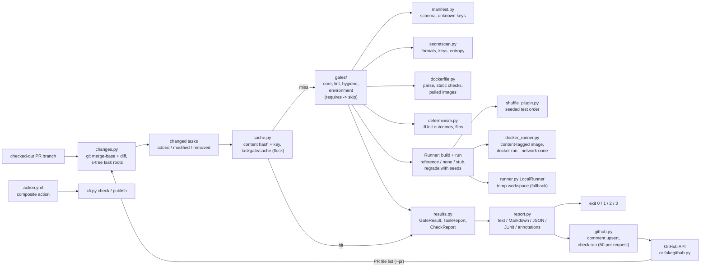

# TaskGate

[](https://github.com/vipul21435/taskgate/actions/workflows/ci.yml)

Review gates for pull requests that add or change benchmark tasks for AI coding
agents. TaskGate finds the task directories a pull request touches, runs each
one through a set of gates with stable codes (layout, manifest schema and lint,
secrets, file sizes and binaries, the environment builds from a digest-pinned
base, the reference solution must pass, an untouched workspace and an
empty-output stub must fail, and the grader must give the same per-test
outcomes when rerun with a shuffled test order and new seeds), and reports the
result as terminal text, a Markdown pull-request summary, JSON, JUnit XML and
GitHub annotations, with a non-zero exit when a blocking gate fails. On GitHub
it keeps one summary comment per pull request up to date and creates a check
run with an annotation per failed gate, through a composite action or the
`taskgate publish` command. Solutions and graders run in the task's own Docker
image with no network and resource limits, or in a local temporary directory
when Docker is not available. Results are cached by a content hash of the
task, so a task that has not changed since it last passed is not checked again.

It mirrors the submission side of benchmark-task work at an AI-data company:
every task has to clear the same review gates before it is accepted, and a
grader that passes when the agent did nothing (or wrote an empty file where the
answer should be) is the most common way a task goes wrong.

## What works today

- **`taskgate check`** diffs the checked-out branch against its merge base with
  `--base` (default `origin/main`, falling back to `main`), maps every changed
  path to the task directory that owns it, labels each task `added`, `modified`
  or `removed`, and runs the gates on every task that still exists. `--all`
  checks every task under a directory instead (no git needed).
- **Fourteen gates**, run in code order; a gate whose prerequisite did not pass,
  or whose input is missing, is reported as `skip` rather than as a second failure:

  | Code | Name | Default | Passes when |
  | --- | --- | --- | --- |
  | TG101 | layout-complete | error | `task.toml`, `instruction.md`, `environment/`, `solution/solve.sh` and a `tests/test_*.py` exist |
  | TG102 | manifest-valid | error | `task.toml` parses; `id` is kebab-case and equals the directory name; `difficulty`, `timeout_sec` (1..3600), `workdir` are valid; every problem is listed at once |
  | TG103 | manifest-known-keys | warning | no table or key outside the schema; each unknown one gets a did-you-mean hint with the qualified name |
  | TG104 | timeout-in-range | warning | `timeout_sec` is inside the recommended range (10..1800 s unless `[manifest]` says otherwise) |
  | TG105 | instruction-not-empty | error | `instruction.md` is UTF-8 and has words beyond headings (ATX and setext), HTML comments (an unclosed `<!--` hides the rest) and bare Markdown markup (empty bullets, rules, fences, `>`) |
  | TG201 | no-secrets | error | no text file holds a known token format (cloud key ids, source-host, chat, payment and `sk-` API keys, JSON web tokens), a private key header or a high-entropy string |
  | TG202 | file-size-limits | error | every file is under 1 MiB and the task under 10 MiB (`[files]`) |
  | TG203 | no-binary-files | error | every binary file (NUL in the first 8000 bytes) matches a `[files] binary_allow` glob |
  | TG301 | environment-builds | error | the Dockerfile passes static checks (known instructions, `FROM` first, every `COPY` source present, non-root `USER`, `workspace/` copied in) and, on the Docker runner, builds |
  | TG302 | base-images-pinned | error | every `FROM`, `COPY --from` and `RUN --mount` `from=` image ends in `@sha256:<digest>` after `ARG` defaults are substituted (`scratch` and build stages exempt) |
  | TG401 | solution-passes | error | `solve.sh` exits 0 and the pytest grader then passes (needs TG101 and a built environment) |
  | TG402 | baseline-fails | error | the grader fails on the untouched workspace and collects at least one test (needs TG101 and a built environment) |
  | TG403 | stub-solution-fails | error | the grader fails after a stub `solve.sh` that creates every file the reference solution created, empty (needs TG401) |
  | TG501 | grader-deterministic | error | on 5 reruns of the grader (`[determinism] runs`) over the reference solution's output, each with a seeded shuffle of the test order, its own `PYTHONHASHSEED` and `TASKGATE_SEED`, every rerun passes and every test has the same outcome (needs TG401) |

  Only `error` failures block. The full task layout, runtime contract and gate
  rules are in [docs/task-layout.md](docs/task-layout.md).
- **Grader determinism (TG501).** The reference solution runs once more, then
  the grader runs 5 times on that same output: before each rerun after the
  first, `snapshot.py` puts back whatever the previous rerun changed, so every
  rerun sees the workspace exactly as `solve.sh` left it (modes, sub-second
  mtimes, hard links and named pipes included). Rerun `i` uses seed `i` (`[determinism] seed`
  moves the start) three ways: a pytest plugin TaskGate bundles
  (`shuffle_plugin.py`, loaded as `-p taskgate_shuffle --taskgate-seed i`)
  shuffles the collected tests with `random.Random(i)` and seeds `random`;
  `PYTHONHASHSEED=i` changes set and hash ordering; `TASKGATE_SEED=i` is there
  for graders that draw random cases. Each rerun writes pytest's JUnit XML, and
  the gate compares the exit code and every test's outcome. It fails when a
  rerun fails, when a test's outcome differs between reruns, or when a test
  fails in every rerun although TG401's run (file order, `PYTHONHASHSEED=0`)
  passed, and lists each flipped test with the runs and seeds of each outcome
  and one command that repeats the first failing rerun.
- **A content-hash result cache** (`cache.py`). Before running the gates on a
  task, `taskgate check` computes a key from the task's content (sorted
  relative POSIX paths, file bytes, permission bits including the executable
  bit, symlink targets; never mtimes or walk order; tool caches such as
  `__pycache__/`, `*.pyc`, `.DS_Store` and `.taskgate/` left out; in diff mode
  also git's list of the task's tracked files), the TaskGate build (version plus
  a digest of its own source), the gates (for a plugin gate also its entry
  point, its distribution's version, the gate object's parameters and the
  source and constants of its module and of what that module imports), the
  effective `taskgate.toml`, the runner and the task's path. A hit replays the
  stored results only when they carry exactly the enabled gates' codes, and
  the report marks the task `(cached)`. Only results without a blocking
  failure are stored, so a failing task is always checked again. A cache
  directory that the checked repository tracks in git is not used (a pull
  request could commit entries), and `taskgate cache stats` and `prune` act
  only on a directory holding TaskGate's `CACHEDIR.TAG` and only on key-named
  entry files, so a wrong `--cache-dir` deletes nothing. Entries live in `.taskgate/cache`
  under the repository root (or the `--all` directory), one JSON file per key,
  written atomically (temp file, `fsync`, `os.replace`) under an `flock` on
  `.taskgate/cache/lock`; the directory carries a `.gitignore` of `*`, so
  `git status` stays clean. `--no-cache` bypasses it, `--cache-dir` (or
  `TASKGATE_CACHE_DIR`) moves it, and a cache that cannot be written is a note
  on stderr, never a failed check. `make demo` ends by checking the good pull
  request again:

  ```
  == taskgate check on pr/1-integer-determinant again (unchanged, expected from the cache)
  taskgate 0.1.0: diff against main (merge base b26918e), 1 changed task, 1 other file, local runner, 1 cached
  tasks/integer-determinant  added  PASS  (cached)
    pass  TG101  layout-complete        layout complete
    ...
    pass  TG501  grader-deterministic   the grader passed all 5 reruns with identical per-test outcomes (3 tests, seeds 1-5, shuffled order)
  result: PASS, 0 blocking failures
  cache      .taskgate/demo/repo/.taskgate/cache
  entries    1 (3.0 KiB): 1 usable by this taskgate build, 0 stale (taskgate cache prune removes them)
  tasks      1 (runners: local 1)
  lookups    1 hit, 4 misses (20% hits)
  stored     1 result set; 3 not stored because a blocking gate failed
  ```

  `taskgate cache prune` removes entries written by another TaskGate build,
  unreadable ones, and all but the most recently used entry per task and runner
  (`--older-than DAYS`, `--all` and `--dry-run` widen or preview it). On a copy
  of the sample repository after one task's `instruction.md` changed:

  ```
  $ taskgate cache prune prunedemo --dry-run
  would remove 1 of 2 entries (3.0 KiB): 1 superseded by a newer entry for the same task and runner; 1 kept in prunedemo/.taskgate/cache
  ```
- **`taskgate grade TASK --seed S`** is that command: it runs the reference
  solution, then the grader exactly as TG501's rerun with seed `S` did, and
  prints pytest's output and each test's outcome in the order the tests ran
  (exit 0 when the grader passes, 1 when it fails).
- **A secret scanner** (`secretscan.py`) that streams every text file line by
  line and never prints more than the first four characters of a match. Its
  high-entropy rule needs mixed case and digits, at least 4.0 bits per
  character, frequent character-class changes, and fewer than 15% common
  English bigrams, the last of which keeps long identifiers such as
  `PyUnicode_AsLatin1String` out. URLs and `sha256=`/`sha512-` digests are
  blanked first. A `taskgate: allow-secret` comment, `[secrets] allow` regexes
  and `exclude` globs handle false positives. Every pattern is linear in the
  line length (patterns that start with a run of characters are anchored at
  the run's start), and TG201 reads at most `[files] max_file_bytes` of a file,
  so a 1,000,000-character one-line input scans in well under a second.
- **Hygiene gates see what the pull request commits.** In diff mode TG201-TG203
  check every file git tracks in the task at `HEAD`, whatever its name, so a
  committed `__pycache__/` file, `*.pyc`, `.DS_Store` or `.mypy_cache/` entry
  cannot slip past them. `--all` walks the directory on disk and leaves those
  tool caches out, and the local runner leaves out the same names when it copies
  a task.
- **A Docker runner** (`--runner docker`, or `auto` when `docker version`
  answers). It builds `environment/Dockerfile` under a tag derived from the build
  context's content (`taskgate-env:<16 hex>`, labelled `project=taskgate`) and
  reuses an image whose label matches, so an unchanged environment is built once.
  Every run is a `docker run --rm` with `--network none`, `--cpus 1`,
  `--memory 1024m` with no extra swap, `--pids-limit 256`, all capabilities
  dropped, `no-new-privileges`, and the image's non-root `USER` (`65534:65534`
  if the image would run as root; the in-container driver refuses uid 0). The
  solution and tests arrive as a tar on stdin into a tmpfs outside the
  workspace, and the task's `timeout_sec` kills the container. Limits are set
  under `[runner]` in `taskgate.toml`.
- **A local runner** (`--runner local`, and the automatic fallback with a note on
  stderr when Docker does not answer) that copies `environment/workspace/`,
  `solution/` and `tests/` into a fresh temporary directory, runs `sh solve.sh`
  and then `python -m pytest` there under the task's `timeout_sec` budget
  (killing the whole process group on timeout), and never writes into the task's
  source tree. On this runner TG301 does the static checks only and says the
  image was not built.
- **A Dockerfile reader** (`dockerfile.py`) that reads lines as Docker does (a
  leading byte order mark dropped, lines split at `\n` only), and handles parser
  directives (`# escape=`), continuations across comment lines, heredocs and
  global `ARG` substitution (`$V`, `${V}`, `${V:-x}`, `${V:+x}`, defaults that
  use earlier `ARG`s), used by TG301 and TG302. The images it lists for TG302
  include the `from=` of `RUN --mount`, which BuildKit pulls like a base image.
- **Reports**: text on stdout (or `--format markdown|json|junit|annotations`),
  plus `report.md`, `report.json` and `junit.xml` under `--out DIR`;
  `taskgate report REPORT.json --format ...` renders a saved report again, and
  `report.json` reads back into the same report object (a test checks the
  round trip). JUnit XML has a `testsuite` per task and a `testcase` per gate
  (blocking failures are `failure`s, warnings pass with the problem in
  `system-out`, skips are `skipped`); `annotations` are GitHub workflow commands
  (`::error file=tasks/x/task.toml,line=1,title=TG501 ...::message`). Each
  file under `--out` is written to a new file and renamed into place, so a
  stale report or a symlink already at that name is replaced, never written
  through. Exit codes: 0 no blocking failure, 1 blocking failure, 2 usage error
  (not a git repository, unknown base ref, invalid `taskgate.toml`, a pull
  request `--pr` cannot read, an `--out` directory that cannot be written), 3
  internal error (a crash: the traceback is printed, and the code is never 1,
  so a crash cannot pass for a finished check).
- **GitHub reporting** (`github.py`, standard library only). The client reads
  its base URL from `TASKGATE_GITHUB_API` (default `https://api.github.com`)
  and its token from `GITHUB_TOKEN`. `taskgate publish REPORT.json --pr N`
  keeps one summary comment per pull request: the comment whose body starts
  with a hidden `<!-- taskgate:summary -->` marker is updated when the report
  changed, left alone when it did not, and created otherwise; it also creates
  a completed check run (`success` or `failure`) whose summary is the Markdown
  report and whose annotations, one per failed gate on the task's `task.toml`,
  are sent 50 per request as the API requires (the first batch with the create
  call, the rest with updates). `taskgate check --pr N` takes the changed files
  from the pull request's file list (100 per page, following the `Link`
  header, and refusing a list the API truncated at 3000 files) instead of
  `git diff`. The token is sent only to the configured base URL: HTTP
  redirects are not followed (a 3xx is an error naming its `Location`),
  pagination links to other hosts are refused, and error messages never
  carry it.
- **An in-process fake GitHub API** (`fakegithub.py`, standard library only)
  serves the same endpoints from a thread, records every request, paginates
  with `Link` headers, answers 401 to a wrong token and 422 to more than 50
  annotations in one request, a comment over 65536 characters or a check-run
  summary over 65535 bytes, as GitHub does. The tests, `make demo` and the
  CI job that runs the composite action all post to it; `python -m
  taskgate.fakegithub --port 8765` serves it to another process and
  `GET /_fake/state` returns what it recorded.
- **A composite GitHub Action** (`action.yml`). It installs TaskGate from its
  lock file with uv, runs `taskgate check` (diff against the pull request's
  base, or `all: "true"` for a directory), writes the three report files,
  appends the Markdown to the job summary, prints an annotation per failed
  gate, and on a pull request runs `taskgate publish` with the job's token. It
  deletes the three report files from `out` before the check and takes the
  verdict and `blocking-failures` from the report this run wrote, parsed by
  TaskGate and required to agree with the exit code (any other exit code, or
  a missing or disagreeing report, fails the step), so an earlier run's report
  or one committed in the pull request is never published. It
  fails the step on a blocking gate unless `fail-on-blocking: "false"`, and
  exposes `result`, `blocking-failures`, `report-dir` and `exit-code` outputs:

  ```yaml
  on: pull_request
  permissions:
    contents: read
    pull-requests: write   # the summary comment
    checks: write          # the check run and its annotations
  jobs:
    taskgate:
      runs-on: ubuntu-latest
      steps:
        - uses: actions/checkout@v7
          with:
            fetch-depth: 0   # the base branch's history, for the merge base
        - uses: vipul21435/taskgate@main
  ```

  On `pull_request` events from a fork, GitHub gives the job a read-only token
  whatever the `permissions` block says, so the API refuses the comment and
  the check run. The action then prints a warning instead of failing the
  step; the report is still in the job summary and the annotations, and
  `fail-on-blocking` still decides the job.

  Inputs: `path`, `base`, `all`, `runner`, `config`, `out`, `pr-files` (take
  the changed files from the pull request), `pr`, `head-sha`, `comment`,
  `check-run`, `check-name`, `github-token`, `github-api`, `path-prefix` and
  `fail-on-blocking`. A test runs the action's own shell steps from
  `action.yml` against the fake API, and the CI job below runs the whole
  action through `uses: ./`.
- **A sample repository builder** (`examples/build_sample_repo.py`) that creates
  a git repository with a `main` branch and four pull-request branches: one
  good task and three flawed ones. Commits use fixed authors and dates, so the
  merge base (`b26918e`) and every report are identical on macOS and in the
  Linux container, and the content-derived image tags are the same on macOS and
  on the GitHub Actions runner.
- **A gate registry.** Every gate satisfies one `Gate` protocol (code, name,
  severity, summary, fix hint, `requires`, `check(ctx)`); `taskgate gates`
  lists every code grouped by hundreds. Third-party gates register through the
  `taskgate.gates` entry-point group and must use TG7xx-TG9xx;
  [examples/plugin](examples/plugin) is a working example (TG701). A plugin that
  fails to load or breaks the contract stops the run with exit code 2, and a gate
  that raises is reported as a failure instead of hiding the other results.
- **`taskgate.toml`** turns gates off (`[gates] disable = [...]`), changes their
  severity (`[gates.severity] TG402 = "warning"`), tunes the static gates and
  sets the Docker runner's limits:

  ```toml
  [manifest]                  # TG104
  min_timeout_sec = 10
  max_timeout_sec = 1800

  [secrets]                   # TG201
  allow = ["^EXAMPLE"]        # regexes on the matched text
  exclude = ["tests/data/*"]  # task-relative path globs, not scanned
  min_length = 24
  entropy_threshold = 4.0

  [files]                     # TG202, TG203
  max_file_bytes = 1048576
  max_task_bytes = 10485760
  binary_allow = ["environment/workspace/*.png"]

  [runner]                    # the Docker runner
  cpus = 1.0
  memory_mb = 1024            # --memory and --memory-swap
  pids_limit = 256
  build_timeout_sec = 900

  [determinism]               # TG501
  runs = 5                    # 2..100 grader reruns
  seed = 1                    # rerun i uses seed + i - 1
  ```

  Unknown sections, keys, gate codes, bad values and invalid regexes are errors
  (exit 2), all listed at once. In diff mode the file is read from the base ref
  (`git show main:taskgate.toml`), so a pull request cannot relax the gates that
  check it; `--config PATH` overrides that. Reports name the config source, every
  override and every option that differs from its default (`config: taskgate.toml;
  options manifest.max_timeout_sec=60, files.max_file_bytes=1024`).
- **Report details.** A gate can attach detail lines to its result: the text
  report prints them under the gate's line, `report.md` lists them under
  "Details" with each reproduce command as code, and `report.json` carries them
  as a `details` list.
- `taskgate tasks [ROOT]` lists task directories and the layout parts each lacks.
- A digest-pinned Docker image (non-root user, git included) that runs the CLI
  and the demo (on the local runner: the image has no Docker CLI), and GitHub
  Actions CI that runs lint, mypy, the tests with a coverage gate and the demo;
  a second job builds the image, runs the demo inside it, then runs the demo on
  the Docker runner and the opt-in real-Docker tests on the runner's daemon; a
  third job starts the fake GitHub API, runs the composite action twice on the
  bundled sample tasks through `uses: ./` (the draft task is blocked, the
  second run comes from the cache and updates the comment in place) and checks
  what reached the fake, then confirms the action fails a job by default.

## Quickstart

```sh
git clone https://github.com/vipul21435/taskgate && cd taskgate
uv sync --locked
make demo
uv run taskgate check --all examples/sample-repo
```

Verified from a fresh clone. `make demo` needs no network, Docker or tokens (it
passes `--runner local` through `TASKGATE_RUNNER`, and its GitHub part talks to
an in-process fake API on `127.0.0.1`) and took 9.53 to 9.93 s over three runs
in a fresh clone on 2026-09-30 (`time make demo`, 8 GB M-series Mac; 9.01 to
9.68 s in the working copy the same day). The last command exits 1 on purpose: the
bundled draft task is incomplete. With Docker running, `make demo-docker` runs
the same four pull requests on the Docker runner (8.4 to 8.7 s with the task
images already built).

## Usage

```
taskgate check [REPO] [--base REF] [--all] [--out DIR] [--format text|markdown|json|junit|annotations]
               [--config FILE] [--runner auto|docker|local] [--no-cache] [--cache-dir DIR]
               [--pr N --repo OWNER/NAME]
taskgate publish REPORT.json --pr N [--repo OWNER/NAME] --sha SHA [--no-comment] [--no-check-run]
                 [--check-name NAME] [--path-prefix DIR]
taskgate report REPORT.json [--format text|markdown|json|junit|annotations] [--path-prefix DIR]
taskgate grade TASK --seed N [--runner auto|docker|local] [--config FILE]
taskgate cache stats [ROOT] [--cache-dir DIR] [--json]
taskgate cache prune [ROOT] [--cache-dir DIR] [--older-than DAYS] [--all] [--dry-run]
taskgate gates [ROOT] [--json] [--config FILE]
taskgate tasks [ROOT] [--json] [--strict]
taskgate version
```

`make demo` builds the sample repository, checks out each pull-request branch
and runs `taskgate check <repo> --base main --out <dir>`, then checks the good
branch once more to show the cache hit. On the good branch:

```
taskgate 0.1.0: diff against main (merge base b26918e), 1 changed task, 1 other file, local runner
tasks/integer-determinant  added  PASS
  pass  TG101  layout-complete        layout complete
  pass  TG102  manifest-valid         manifest valid
  pass  TG103  manifest-known-keys    no unknown keys
  pass  TG104  timeout-in-range       task.timeout_sec 120 is within 10..1800
  pass  TG105  instruction-not-empty  instruction.md has 88 words
  pass  TG201  no-secrets             no secrets in 6 text files
  pass  TG202  file-size-limits       6 files, 3.5 KiB in total
  pass  TG203  no-binary-files        no binary files
  pass  TG301  environment-builds     Dockerfile passes the static checks; not built: the local runner does not use Docker
  pass  TG302  base-images-pinned     1 image pinned by sha256 digest
  pass  TG401  solution-passes        reference solution passes the grader (3 passed)
  pass  TG402  baseline-fails         an untouched workspace fails the grader (3 failed)
  pass  TG403  stub-solution-fails    a stub that writes output/determinants.txt empty fails the grader (2 failed, 1 passed)
  pass  TG501  grader-deterministic   the grader passed all 5 reruns with identical per-test outcomes (3 tests, seeds 1-5, shuffled order)
result: PASS, 0 blocking failures
```

On the second branch, whose grader calls `pytest.skip` when the output file is
missing, whose manifest says `difficulty = "trivial"`, and whose `solve.sh`
exports a leftover API key (a planted random string, exit code 1):

```
taskgate 0.1.0: diff against main (merge base b26918e), 1 changed task, local runner
tasks/word-count  added  FAIL
  pass  TG101  layout-complete        layout complete
  FAIL  TG102  manifest-valid         task.difficulty 'trivial' is not one of easy, medium, hard
        fix: Fix task.toml to match the manifest schema in docs/task-layout.md.
  pass  TG103  manifest-known-keys    no unknown keys
  pass  TG104  timeout-in-range       task.timeout_sec 60 is within 10..1800
  pass  TG105  instruction-not-empty  instruction.md has 67 words
  FAIL  TG201  no-secrets             1 likely secret: solution/solve.sh:7 high-entropy string 'huG8...' (32 chars)
        fix: Remove the credential and rotate it, since it has been pushed. For a false positive, add 'taskgate: allow-secret' to the line, or an allow regex or exclude glob under [secrets] in taskgate.toml.
  pass  TG202  file-size-limits       6 files, 2.4 KiB in total
  pass  TG203  no-binary-files        no binary files
  pass  TG301  environment-builds     Dockerfile passes the static checks; not built: the local runner does not use Docker
  pass  TG302  base-images-pinned     1 image pinned by sha256 digest
  pass  TG401  solution-passes        reference solution passes the grader (2 passed)
  FAIL  TG402  baseline-fails         the grader passes an untouched workspace (2 skipped)
        fix: Make the grader assert on the output the instruction asks for, so a workspace where nothing was done cannot pass (no skips or early returns).
  pass  TG403  stub-solution-fails    a stub that writes output/counts.txt empty fails the grader (2 failed)
  pass  TG501  grader-deterministic   the grader passed all 5 reruns with identical per-test outcomes (2 tests, seeds 1-5, shuffled order)
result: FAIL, 3 blocking failures
```

The third branch adds a task whose grader does fail an untouched workspace (it
asserts that `output/gcds.txt` exists), so TG402 passes, but compares lines with
a non-strict `zip()`, so an empty file passes every comparison; its Dockerfile
also names the base image by tag only. This run used the Docker runner
(`make demo-docker`), so TG301 built the image:

```
taskgate 0.1.0: diff against main (merge base b26918e), 1 changed task, docker runner
tasks/gcd-pairs  added  FAIL
  pass  TG101  layout-complete        layout complete
  pass  TG102  manifest-valid         manifest valid
  pass  TG103  manifest-known-keys    no unknown keys
  pass  TG104  timeout-in-range       task.timeout_sec 60 is within 10..1800
  pass  TG105  instruction-not-empty  instruction.md has 70 words
  pass  TG201  no-secrets             no secrets in 6 text files
  pass  TG202  file-size-limits       6 files, 2.6 KiB in total
  pass  TG203  no-binary-files        no binary files
  pass  TG301  environment-builds     environment builds: image taskgate-env:d98b9b87a032cdee
  FAIL  TG302  base-images-pinned     1 image is not pinned by digest: line 3: FROM python:3.12-slim
        fix: Pin each image by digest, e.g. FROM python:3.12-slim@sha256:<digest> (docker buildx imagetools inspect python:3.12-slim prints it); scratch and earlier build stages need no digest.
  pass  TG401  solution-passes        reference solution passes the grader (2 passed)
  pass  TG402  baseline-fails         an untouched workspace fails the grader (2 failed)
  FAIL  TG403  stub-solution-fails    the grader passes a stub that writes output/gcds.txt empty (2 passed)
        fix: Make the grader check what each output contains, not only that it exists: compare exact content or line counts (zip(..., strict=True)), so empty placeholder files cannot pass.
  pass  TG501  grader-deterministic   the grader passed all 5 reruns with identical per-test outcomes (2 tests, seeds 1-5, shuffled order)
result: FAIL, 2 blocking failures
```

The fourth branch adds a task whose grader parses the output in its first test
and caches it in a module-level dict that the other two tests read. Every other
gate passes, since pytest runs tests in file order; TG501 shuffles the order,
and the two tests that read the cache fail whenever they run before the one
that fills it. This run used the Docker runner too:

```
taskgate 0.1.0: diff against main (merge base b26918e), 1 changed task, docker runner
tasks/log-levels  added  FAIL
  ...
  pass  TG401  solution-passes        reference solution passes the grader (3 passed)
  pass  TG402  baseline-fails         an untouched workspace fails the grader (3 failed)
  pass  TG403  stub-solution-fails    a stub that writes output/counts.txt empty fails the grader (2 failed, 1 passed)
  FAIL  TG501  grader-deterministic   4 of 5 reruns failed; 2 tests flipped: tests/test_outputs.py::test_counts_match, tests/test_outputs.py::test_one_line_per_level
        - tests/test_outputs.py::test_counts_match: failed in runs 1, 2, 3, 4 (seeds 1, 2, 3, 4); passed in run 5 (seed 5); reproduce: taskgate grade tasks/log-levels --seed 1 --runner docker
        - tests/test_outputs.py::test_one_line_per_level: failed in runs 1, 2, 3, 4 (seeds 1, 2, 3, 4); passed in run 5 (seed 5); reproduce: taskgate grade tasks/log-levels --seed 1 --runner docker
        fix: Make each test independent of test order, hash order and chance: no state shared between tests, sort sets and dict keys before comparing or printing, and seed any random generator from TASKGATE_SEED. Run the reproduce command from the directory the task paths are relative to.
result: FAIL, 1 blocking failure
```

The reproduce command, run from the sample repository's root on that branch,
shows the failing order (the two cache readers ran before the test that fills
the cache):

```
$ taskgate grade tasks/log-levels --seed 1 --runner local
taskgate grade tasks/log-levels: reference solution, then the grader with seed 1 (shuffled order, PYTHONHASHSEED=1, TASKGATE_SEED=1), local runner
FF.                                                                      [100%]
...
E       AssertionError: assert {} == {'DEBUG': 2, ... 6, 'WARN': 2}
...
2 failed, 1 passed in 0.02s
failed   tests/test_outputs.py::test_counts_match
failed   tests/test_outputs.py::test_one_line_per_level
passed   tests/test_outputs.py::test_output_parses
result: FAIL (pytest exited 1)
```

With `--seed 5` the same command prints the three tests in file order and
`result: PASS`.

The `report.md` written for that branch on the local runner, ready to post as a
pull-request comment:

```markdown
## TaskGate: FAIL

1 blocking failure; diff against main (merge base b26918e), 1 changed task, local runner.

| Task | Change | Verdict | Blocking gates |
| --- | --- | --- | --- |
| `tasks/log-levels` | added | **fail** | TG501 |

### `tasks/log-levels`

| Gate | Status | Message |
| --- | --- | --- |
| TG101 layout-complete | pass | layout complete |
| TG102 manifest-valid | pass | manifest valid |
| TG103 manifest-known-keys | pass | no unknown keys |
| TG104 timeout-in-range | pass | task.timeout_sec 60 is within 10..1800 |
| TG105 instruction-not-empty | pass | instruction.md has 96 words |
| TG201 no-secrets | pass | no secrets in 6 text files |
| TG202 file-size-limits | pass | 6 files, 3.1 KiB in total |
| TG203 no-binary-files | pass | no binary files |
| TG301 environment-builds | pass | Dockerfile passes the static checks; not built: the local runner does not use Docker |
| TG302 base-images-pinned | pass | 1 image pinned by sha256 digest |
| TG401 solution-passes | pass | reference solution passes the grader (3 passed) |
| TG402 baseline-fails | pass | an untouched workspace fails the grader (3 failed) |
| TG403 stub-solution-fails | pass | a stub that writes output/counts.txt empty fails the grader (2 failed, 1 passed) |
| TG501 grader-deterministic | **fail** (error) | 4 of 5 reruns failed; 2 tests flipped: tests/test_outputs.py::test_counts_match, tests/test_outputs.py::test_one_line_per_level |

Details:

- **TG501**: tests/test_outputs.py::test_counts_match: failed in runs 1, 2, 3, 4 (seeds 1, 2, 3, 4); passed in run 5 (seed 5); reproduce: `taskgate grade tasks/log-levels --seed 1 --runner local`
- **TG501**: tests/test_outputs.py::test_one_line_per_level: failed in runs 1, 2, 3, 4 (seeds 1, 2, 3, 4); passed in run 5 (seed 5); reproduce: `taskgate grade tasks/log-levels --seed 1 --runner local`

How to fix:

- **TG501**: Make each test independent of test order, hash order and chance: no state shared between tests, sort sets and dict keys before comparing or printing, and seed any random generator from TASKGATE_SEED. Run the reproduce command from the directory the task paths are relative to.

<sub>taskgate 0.1.0</sub>
```

A copy of the accepted sample task with a broken environment (no `USER`, and a
`RUN pip install` step that exits 1), checked with
`taskgate check --all DIR --runner docker` (the lines that did not pass). The
static problem and the build failure are reported together, and the runtime
gates skip instead of failing a second time:

```
taskgate 0.1.0: all tasks, 1 task, docker runner
tasks/modular-inverse  FAIL
  FAIL  TG301  environment-builds     the final stage has no USER instruction, so the image runs as root; docker build failed (exit 1): ERROR: failed to build: failed to solve: process "/bin/sh -c pip install --no-cache-dir pytest==9.1.2 && useradd --create-home --uid 1000 agent && mkdir /workspace && chown agent /workspace" did not complete successfully: exit code: 1
        fix: Make docker build environment/ succeed: every COPY source must exist in environment/, environment/workspace/ must be copied into the image, and the final stage needs a non-root USER.
  skip  TG401  solution-passes        skipped: the environment did not build (see TG301)
  skip  TG402  baseline-fails         skipped: the environment did not build (see TG301)
  skip  TG403  stub-solution-fails    skipped: requires TG401 to pass
  skip  TG501  grader-deterministic   skipped: requires TG401 to pass
result: FAIL, 1 blocking failure
```

Manifest lint on a copy of the accepted sample task with two typos
(`timout_sec`, `[enviroment]`), checked with `taskgate check --all DIR`. TG102
reports what is missing, TG103 names the probable typo, TG104 skips because the
timeout is unusable, and the warning does not add to the blocking count:

```
modular-inverse  FAIL
  pass  TG101  layout-complete        layout complete
  FAIL  TG102  manifest-valid         missing [environment] table; missing task.timeout_sec; missing environment.dockerfile; missing environment.workdir
        fix: Fix task.toml to match the manifest schema in docs/task-layout.md.
  fail  TG103  manifest-known-keys    unknown in task.toml: task.timout_sec (did you mean task.timeout_sec?), [enviroment] (did you mean [environment]?)
        fix: Rename or remove the unknown keys; every key task.toml may hold is listed in docs/task-layout.md.
  skip  TG104  timeout-in-range       task.timeout_sec is missing or invalid (see TG102)
  pass  TG105  instruction-not-empty  instruction.md has 100 words
  ...
result: FAIL, 1 blocking failure
```

`taskgate gates` lists every code with its effective severity:

```
TG1xx  layout and manifest
  TG101  error    layout-complete        task.toml, instruction.md, environment/, solution/solve.sh and tests/test_*.py
  TG102  error    manifest-valid         task.toml parses and has every required key with a valid value
  TG103  warning  manifest-known-keys    task.toml has no unknown tables or keys (likely typos)
  TG104  warning  timeout-in-range       task.timeout_sec is inside the recommended range (default 10..1800 s)
  TG105  error    instruction-not-empty  instruction.md is UTF-8 and has words beyond headings, comments and bare markup
TG2xx  hygiene
  TG201  error    no-secrets             no credentials: known token formats, private keys or high-entropy strings
  TG202  error    file-size-limits       every file and the task as a whole stay under the size limits (1 MiB, 10 MiB)
  TG203  error    no-binary-files        no binary files unless [files] binary_allow lists them
TG3xx  environment
  TG301  error    environment-builds     environment/Dockerfile passes the static checks and builds (Docker runner)
  TG302  error    base-images-pinned     every image the build pulls (FROM, COPY --from, RUN --mount from=) is digest-pinned
TG4xx  solution and baselines
  TG401  error    solution-passes        the reference solution passes the grader in a fresh workspace
  TG402  error    baseline-fails         the grader fails when no solution has run (untouched workspace)
  TG403  error    stub-solution-fails    a stub that writes the reference solution's new files, empty, fails the grader
TG5xx  determinism
  TG501  error    grader-deterministic   the grader gives the same verdict and per-test outcomes on N reruns with shuffled test order and new seeds
14 gates: 14 built-in, 0 from plugins
```

`report.json` carries the same data plus the runner, the full merge-base hash,
each task's changed files, and a `blocking` flag and a `details` list per gate.
CI appends the demo reports of both runners to the job summaries.

`junit.xml` for the same branch (the passing gates are `testcase`s with no
children; the whole file is 28 lines):

```xml
<?xml version="1.0" encoding="utf-8"?>
<testsuites name="taskgate" tests="14" failures="1" errors="0" skipped="0">
  <testsuite name="tasks/log-levels" tests="14" failures="1" errors="0" skipped="0">
    <testcase classname="tasks/log-levels" name="TG101 layout-complete" />
    ...
    <testcase classname="tasks/log-levels" name="TG501 grader-deterministic">
      <failure message="4 of 5 reruns failed; 2 tests flipped: tests/test_outputs.py::test_counts_match, tests/test_outputs.py::test_one_line_per_level" type="error">tests/test_outputs.py::test_counts_match: failed in runs 1, 2, 3, 4 (seeds 1, 2, 3, 4); passed in run 5 (seed 5); reproduce: taskgate grade tasks/log-levels --seed 1 --runner local
tests/test_outputs.py::test_one_line_per_level: failed in runs 1, 2, 3, 4 (seeds 1, 2, 3, 4); passed in run 5 (seed 5); reproduce: taskgate grade tasks/log-levels --seed 1 --runner local
fix: Make each test independent of test order, hash order and chance: no state shared between tests, sort sets and dict keys before comparing or printing, and seed any random generator from TASKGATE_SEED. Run the reproduce command from the directory the task paths are relative to.</failure>
    </testcase>
  </testsuite>
</testsuites>
```

`make demo` ends with the GitHub part (`examples/github_demo.py`): it starts the
fake API in-process, registers the fourth pull request's file list, checks the
branch with `--pr 4` (the header then says `files of pull request #4`) and
publishes the report twice. The second `publish` finds the comment by its marker
and leaves it alone:

```
$ taskgate publish .taskgate/demo/out/github/pr-4/report.json --pr 4 --sha 804204f4d05bfba9ea1d3e032db38d3ce38d456d
comment created: https://github.example/sample/tasks/pull/4#issuecomment-1
check run failure: 1 annotation in 1 request: https://github.example/sample/tasks/runs/2

$ taskgate publish .taskgate/demo/out/github/pr-4/report.json --pr 4 --sha 804204f4d05bfba9ea1d3e032db38d3ce38d456d --no-check-run
comment unchanged: https://github.example/sample/tasks/pull/4#issuecomment-1

== requests the fake GitHub API received
GET /repos/sample/tasks/pulls/4 -> 200
GET /repos/sample/tasks/pulls/4/files?per_page=100 -> 200
GET /repos/sample/tasks/issues/4/comments?per_page=100 -> 200
POST /repos/sample/tasks/issues/4/comments -> 201
POST /repos/sample/tasks/check-runs -> 201 (1 annotation)
GET /repos/sample/tasks/issues/4/comments?per_page=100 -> 200

comment 1 starts with: <!-- taskgate:summary -->
check run 2: failure, title 'TaskGate: FAIL, 1 blocking failure'
  failure  tasks/log-levels/task.toml:1  TG501 grader-deterministic
```

The annotation the action prints for the same report, as the workflow command
GitHub turns into an inline annotation (`taskgate report REPORT.json --format
annotations`; newlines are `%0A`):

```
::error file=tasks/log-levels/task.toml,line=1,title=TG501 grader-deterministic::4 of 5 reruns failed; 2 tests flipped: tests/test_outputs.py::test_counts_match, tests/test_outputs.py::test_one_line_per_level%0Atests/test_outputs.py::test_counts_match: failed in runs 1, 2, 3, 4 (seeds 1, 2, 3, 4); passed in run 5 (seed 5); reproduce: taskgate grade tasks/log-levels --seed 1 --runner local%0A...
```

## Architecture



| Module | Role |
| --- | --- |
| `layout.py` | task discovery on disk (`task.toml` marks a task; outermost wins; hidden and tool dirs skipped) |
| `changes.py` | changed-task discovery from git, using the same task rules on `git ls-tree` of both refs |
| `manifest.py` | `task.toml` parsing, schema validation that collects every problem, unknown keys with did-you-mean hints |
| `runner.py` | the `Runner` protocol (`build`, `run` with a reference, no or stub solution, `regrade` with seeds), `RunResult`, `Regrade`, the local subprocess runner |
| `docker_runner.py` | the Docker runner (content-derived tags, locked-down `docker run`, in-container driver with a regrade mode), `docker_status` and the auto/docker/local choice |
| `shuffle_plugin.py` | the pytest plugin copied into every TG501 rerun: seeded test order and a seeded `random` |
| `snapshot.py` | records the solved workspace and puts back only what a rerun changed; imported by the local runner, run as a script in the container (Python 3.8+, stdlib only) |
| `determinism.py` | JUnit XML to pytest test ids and outcomes, flipped tests and how to describe them |
| `dockerfile.py` | Dockerfile parsing, the static checks behind TG301, the pulled-image list behind TG302 |
| `files.py` | which task paths are content (caches, `.DS_Store` and `.taskgate/` are not) and a sorted walk |
| `cache.py` | the task content hash, the cache key, the atomic, locked result store, `stats` and `prune`, and `CachedChecks` (lookup before the gates, store after) |
| `gates/` | the `Gate` protocol, `TaskContext` and `@gate` (`base.py`); layout, manifest and runtime gates (`core.py`); manifest and instruction lint (`lint.py`); secrets, sizes and binaries (`hygiene.py`); build and digest pins (`environment.py`); grader determinism (`determinism.py`) |
| `secretscan.py` | the credential detectors behind TG201, with redacted findings |
| `config.py` | `taskgate.toml` parsing and validation (every problem at once): gates, `[manifest]`, `[secrets]`, `[files]`, `[runner]`, `[determinism]` |
| `registry.py` | built-in plus entry-point gates, validated and sorted by code |
| `engine.py` | `run_gates`: runs gates in code order, skips unmet `requires`, contains gate crashes |
| `report.py` | pure renderers from a `CheckReport` to text, Markdown, JSON, JUnit XML and workflow-command annotations; `findings` (one located entry per failed gate) and `from_json` (a `report.json` back into a `CheckReport`) |
| `github.py` | the stdlib GitHub client: pull-request file list (paginated), one summary comment by marker, check runs with annotations 50 per request |
| `fakegithub.py` | the in-process, recording fake of those endpoints (tests, `make demo`, the CI action job) |
| `cli.py` | Typer commands `check` (with `--runner`, `--no-cache`, `--cache-dir`, `--pr`), `publish`, `report`, `grade`, `cache stats`, `cache prune`, `gates`, `tasks`, `version` |
| `action.yml` | the composite GitHub Action: install from the lock file, `check`, job summary, annotations, `publish`, outputs |

## Measured

| What | Command | Result |
| --- | --- | --- |
| Tests and coverage | `make cov` | 554 passed, 9 skipped (the opt-in real-Docker tests and one Linux-only name test) in 132 s; 100% line and branch coverage of `src/` (3936 statements, 1076 branches); gate is 90% |
| Real-Docker tests | `time make test-docker` | 8 passed in 18.5 s (task images already built), including TG501 in a real container finding the same flips as the local runner, restoring a root-owned `mkdir -m 777` workdir, keeping mode bits, hard links, pipes and sub-second mtimes across reruns, and capping JUnit XML like the local runner |
| Demo wall time, local runner | `time make demo` | 9.53 to 9.93 s over three runs in a fresh clone and 9.01 to 9.68 s in the working copy (four pull requests, the cached re-check and the GitHub part against the fake API) |
| Demo wall time, Docker runner | `time make demo-docker` | 8.76 s on both of two runs with the four task images built |
| Cache hit vs full check, one task | `time taskgate check <demo repo> --base main` on `pr/1-integer-determinant`, with `--no-cache` and cached (three runs each) | local runner 1.13 to 1.18 s uncached, 0.18 s cached; Docker runner 1.89 to 1.95 s uncached, 0.21 to 0.22 s cached |
| Cache on the bundled samples | `time taskgate check --all examples/sample-repo --runner local --cache-dir DIR`, first run and three more | 1.06 to 1.10 s, then 0.10 to 0.11 s once the complete task is cached (the incomplete draft fails TG101, so it is never stored) |
| Demo in the TaskGate image | `time docker run --rm --entrypoint sh taskgate:local examples/demo.sh /tmp/taskgate-demo` | 9.96 and 10.51 s over two runs (6.56 to 6.91 s before the GitHub part) |
| TG501 cost | `time taskgate check --all examples/sample-repo --runner local`, with and without `[gates] disable = ["TG501"]` | 1.08 to 1.21 s with it, 0.50 to 0.56 s without (three runs each; one complete task, five grader reruns) |
| Image sizes | `docker image ls taskgate`, `docker image ls taskgate-env` | TaskGate image 473 MB (python:3.12-slim plus git); each sample task image 235 MB |
| Reports, macOS vs image | `cmp` of each demo `report.md`, `report.json` and `junit.xml` (four pull requests plus the `--pr 4` run) | all 15 byte-identical, TG501's shuffled reruns included |
| Check-run batching | `tests/test_github.py` against the fake, which answers 422 to 51 annotations like GitHub | 120 annotations sent as 50 + 50 + 20 in 3 requests; 0 annotations in 1 request |
| Composite action in CI | `gh run view` of the `action` job (run 36654517165) | 27 s for two runs of `uses: ./` on the sample tasks with the Docker runner, the second one cached; the fake recorded one comment created then updated and two check runs |
| Image tags, macOS vs CI | TG301 messages of `make demo-docker` locally and in the CI log | the same four tags (`taskgate-env:8c498462f77c4f11`, `...13e3d22e858b2e52`, `...d98b9b87a032cdee`, `...4c55c370265970c9`), and the same TG501 flips |
| Secret-scan false positives | `uv run python examples/secret_survey.py scan .venv/lib/python3.12/site-packages` | 0 findings in 2523 text files, 689,539 lines of the locked dependencies (macOS arm64), 4.3 s |
| Secret-scan recall | `uv run python examples/secret_survey.py recall` | 2000 seeded random base64 tokens per length: 24 chars 0.8905, 32 chars 0.9665, 40 chars 0.9720, 64 chars 0.9975 |
| Secret scan on the samples | `uv run python examples/secret_survey.py scan examples` | 1 finding: the key planted in the bad demo pull request |
| Secret scan, one long line | `uv run python examples/secret_survey.py timing` | 0.002 s at 20,000 characters, 0.009 s at 80,000 and 0.109 s at 1,000,000, the same for a run of one letter, random `a`/`b`, hex and DNA; before the URL pattern was anchored, 20,000 and 40,000 letters took 0.275 s and 1.094 s (quadratic) |

## Design decisions

- **Three-dot diff.** Changes are taken from the merge base of the base ref and
  `HEAD`, so commits that land on `main` after the branch forked are never
  attributed to the pull request. Renames are split (`--no-renames`) into a
  removed task and an added task, so the new location is always checked.
- **One task rule everywhere.** A task is the outermost directory holding
  `task.toml`, outside hidden and tool directories. The disk scan and the git
  scan (`git ls-tree` on both refs) apply the same rule, so `tasks` and `check`
  never disagree about what a task is.
- **Skip, do not cascade.** Runtime gates require TG101; when the layout is
  broken they report `skip` with the reason instead of a confusing crash.
  Manifest problems (TG102) do not skip the runtime gates, so an author sees
  every real problem in one run. The lint gates skip themselves when the file
  they lint is missing or does not parse (TG101 and TG102 already say so), and
  a warning-level lint failure never blocks.
- **Secrets are never echoed.** TG201 findings carry the path, line, detector
  and only the first four characters, so a report posted to a pull request does
  not republish the credential. Test fixtures build their fake tokens at runtime
  so no token literal sits in this repository; the one planted in the demo is a
  random string with no known format.
- **Baseline means untouched.** TG402 runs the grader with no solution at all.
  pytest exit code 5 (no tests collected) fails the gate too, since a grader
  with no tests passes nothing and rejects nothing.
- **A stub, not only a blank.** TG403 learns which files the reference solution
  creates (a workspace listing before and after `solve.sh`, on either runner)
  and reruns the grader after a generated `solve.sh` that creates exactly those
  files, empty. It catches the grader that fails an untouched workspace but
  never looks inside the output; files the reference edits in place are left
  as they were, so for fix-the-code tasks the stub is a no-op.
- **Content-addressed environments.** The image tag is a SHA-256 over the build
  context (paths, bytes, executable bits, symlink targets; caches excluded) and
  the image carries it as a label, so an unchanged environment is never rebuilt,
  two tasks with identical environments share one image, and the tag is the
  same on every machine.
- **Locked-down runs, the image's own workdir.** Containers get no network, a
  CPU, memory and process cap, no capabilities and a non-root user; the
  solution and tests are streamed in on stdin (no bind mounts, so it also works
  when TaskGate itself runs in a container that talks to a remote daemon) and
  land in a tmpfs, while the workspace is whatever the Dockerfile put in the
  workdir, which is what an agent would see.
- **One contract, two runners.** Docker is used whenever it answers; otherwise
  the local runner runs the same three kinds of run and TG301 falls back to its
  static checks, with a note on stderr and the runner named in every report.
  `--runner docker` turns the fallback into an error for CI that must not
  silently lose isolation. TG401 and TG402 skip when the environment did not
  build, so a broken Dockerfile is reported once, by TG301.
- **Docker-free unit tests of the Docker runner.** A fake `docker` executable on
  PATH (`tests/fake_docker_cli.py`) records every argv, emulates builds and image
  inspection, and runs the real in-container driver script on the host, so the
  flags, the tar stream, the step markers, timeouts and the created-file listing
  are all covered without a daemon. Eight opt-in tests (`make test-docker`)
  check the same paths against real Docker, including that a container sees no
  network, a non-root uid, `memory.max` and `pids.max`, and that TG501's
  reruns survive a root-owned workdir and keep every mode bit and mtime.
- **Determinism is checked against identical inputs.** TG501 grades one
  solution output five times rather than rerunning the solution, so a flip is
  the grader's alone. Every rerun sees that output exactly: `snapshot.py`
  records each entry (type, mode, nanosecond times, inode and change time, hard
  links) and copies file contents into a store outside the workspace (the
  Docker driver keeps it in its tmpfs), and before each later rerun it recreates
  only the entries whose inode or change time moved. An untouched entry keeps
  its inode and owner, so a grader that writes into the workspace cannot change
  a later rerun, and one that does not write sees the very same files. Both
  runners use the same module (the Docker runner copies it into the container),
  so they agree on hard links, named pipes, unreadable files and mode bits,
  and a workdir the run user may write but does not own (`mkdir -m 777`) works. A rerun is fully
  determined by its seed: the plugin shuffles with `random.Random(seed)` and
  seeds `random` before collection, which is why `taskgate grade --seed S`
  reproduces it, and why the demo's flips are the same on macOS, in the image
  and on the CI runner.
- **"Flipped" includes "always fails".** TG401 already ran the grader once in
  file order with `PYTHONHASHSEED=0` and it passed, so a test that fails in all
  five reruns (a grader that iterates a set the solution also iterated, say)
  has flipped against that run and is reported the same way.
- **Test ids from JUnit XML.** Outcomes come from pytest's own JUnit report
  (`xunit1`, which keeps the file), not from parsing console output, and the
  ids are rebuilt as `tests/test_x.py::Class::test_y[param]`, the form pytest
  accepts on its command line.
- **Hermetic local runs.** The runner works on copies in a temporary directory,
  writes an empty `pytest.ini` there so the surrounding repository's pytest
  config cannot leak in, drops `PYTEST_*` and coverage variables, sets
  `PYTHONHASHSEED=0`, and runs the grader with TaskGate's own interpreter
  (pytest is a runtime dependency for that reason).
- **Cache what passed, keyed by everything a result depends on.** A result is
  reused only when the task's bytes, modes, paths and symlinks, the TaskGate
  source, the gates, the config, the runner and the task's path all match. The
  TaskGate part is a digest of its own source, not just the version string, so
  an edited checkout never replays results of older code. Blocking failures are
  never stored, which keeps a transient failure (a Docker hiccup, a timeout
  under load) from sticking; the cost is that a failing task is always
  re-checked. Writes are atomic and serialized by a lock file, lookups need no
  lock, and a broken cache degrades to a normal run.
- **Byte-stable reports.** Reports hold no timings (pytest durations are stripped
  from summaries) and no absolute paths, and the demo repository has fixed
  commit metadata; a test checks that two independent builds produce identical
  output. The JUnit XML follows the same rule (no `time` attributes), which is
  also what lets `publish` tell an unchanged report from a changed one by
  comparing comment bodies.
- **One comment per pull request, found by a marker.** The summary comment
  starts with a hidden HTML comment; `publish` updates that comment instead of
  adding one per push, and skips the API write when the body is unchanged. A
  check run is created per `publish` (GitHub shows the latest run of a name
  per commit), with the Markdown report as its summary, so the verdict is in
  the Checks tab even when comments are off.
- **Publishing is a separate step from checking.** `check` needs no token and
  writes `report.json`; `publish` reads it and needs `GITHUB_TOKEN`. The
  composite action runs them one after the other, so a workflow can check on
  every push and post only from a job that has `pull-requests: write`, and a
  report can be posted again later without rerunning the gates.
- **The GitHub client is stdlib and fakeable.** `urllib` plus a fixed set of
  headers, so no HTTP dependency; the base URL is an environment variable,
  so the tests and the demo talk to `fakegithub.py` over real HTTP in the
  same process, and the CI job that exercises `action.yml` talks to it over
  a port. The fake enforces the two limits the client is built around (50
  annotations per request, `Link`-header pagination), so the tests would fail
  if the client stopped batching or paging.
- **Fresh repository, MIT.** No existing permissively licensed project was small
  and close enough to build on (see [PLAN.md](PLAN.md)).

## Known issues

- The local runner is not a sandbox: `solve.sh` and the grader run as the
  current user with network and filesystem access, and the grader uses
  TaskGate's own Python 3.12 and pytest, so a task that needs other packages only
  passes on the Docker runner.
- On both runners the tests are present (in a separate directory) while
  `solve.sh` runs, so a reference solution could read them; the grader is not
  hidden from the solution.
- The Docker runner needs the image to provide `sh`, `tar`, `find`, `wc` and
  `python` (or `python3`, 3.8 or later) with pytest, and a workdir the image's
  user can write;
  the samples do this in five lines, and a missing piece shows up as a TG401
  failure with the container's output.
- TG301's static checks cannot see a `USER` inherited from the base image, so a
  Dockerfile must set `USER` in its final stage even when the base already does.
- TG302 does not list the frontend image a `# syntax=` directive names or images
  that a base image's `ONBUILD` triggers pull, and it substitutes only global
  `ARG` defaults (not `ARG`s declared inside a stage).
- Task images accumulate under `taskgate-env:*`; nothing prunes them
  automatically (`make clean-images` removes them all).
- The TaskGate image has no Docker CLI, so `taskgate check` inside it always
  uses the local runner.
- The diff is taken from committed `HEAD`, while gates read the working tree;
  uncommitted edits are checked only if they sit inside a task the commits
  already touch.
- Gates run sequentially; only the cache skips work, and only for tasks whose
  last check had no blocking failure.
- A cached pass is replayed as long as nothing in its key changes, so a flake
  that TG501's reruns missed once stays hidden until the task, the config or
  TaskGate changes (`--no-cache` forces a fresh check). The key covers the task
  directory, not what a symlink inside it points to: a symlink leading outside
  the task makes the task uncacheable (a note on stderr), and nothing outside
  the task directory other than the config is hashed.
- The key includes the host's Python, pytest and platform even on the Docker
  runner, so upgrading TaskGate's own environment misses every entry once.
- For a plugin gate the key follows imports one hop from the gate's module and
  its entry-point module: editing a module that a plugin's helper imports (two
  hops away) does not invalidate cached results. Bumping the plugin's version
  or `--no-cache` does.
- Cache entries are not signed. The cache refuses a directory the checked
  repository tracks, but anyone who can write the cache directory on the
  machine that runs TaskGate (for example a restored CI cache from an
  untrusted job) can plant a replayed pass; keep the cache per trusted
  workflow or use `--no-cache` there.
- Cache entries accumulate until `taskgate cache prune` runs; nothing prunes them
  automatically.
- In the TaskGate image the application directory is not writable by its user,
  so `check --all examples/sample-repo` there prints a note and runs uncached.
- TG501 roughly doubles the time of the runtime gates on a small task (1.1 s
  against 0.5 s on the sample repository) because it adds a solution run and
  five grader runs; on a slow grader the cost grows with it. The solution run
  and the reruns share `(runs + 1) x timeout_sec`.
- TG501 catches order, hash-seed and seeded-randomness dependence that shows up
  within its reruns. A flake that five runs do not hit (a race, a timing
  threshold, a one-in-a-hundred order) passes; more runs (`[determinism] runs`,
  up to 100) lower that chance but never remove it. The plugin seeds Python's
  `random` only, not NumPy or other generators.
- The shuffle permutes individual tests, so module- and class-scoped fixtures
  are set up more often than in file order; a grader that is only correct under
  its file's fixture order is reported as flaky, which is the point, but the
  first failure can be a setup error rather than an assertion.
- JUnit XML over 8 MiB is not read on either runner; such a rerun is reported
  as leaving no readable JUnit XML, with "JUnit XML over the 8 MiB limit (not
  read)" in its detail.
- The rerun restore works as the run user. An entry a rerun changed that belongs
  to another user (a file the Dockerfile copied in without `--chown` and left
  writable) comes back owned by the run user; the workdir's own mtime is not
  reset when the run user does not own it; a file the run user can neither read
  nor `chmod` fails TG501 only if a rerun changes it; a directory it can neither
  list nor `chmod` stops TG501 before the reruns ("could not save the solved
  workspace"); and a socket or device file a rerun removed cannot be recreated.
  Inode numbers and change times of recreated entries differ from rerun 1's.
- `taskgate grade` takes the task path as reports print it, relative to the
  repository root in diff mode, so it must be run from that directory.
- Annotations sit on line 1 of each task's `task.toml`, whatever file the gate
  is about: gate results carry no file or line, and TG201's `path:line` is only
  in its message. Workflow-command annotations are also capped by GitHub at 10
  per step for each level (the check run carries them all).
- The GitHub client does not retry: a transient 5xx fails `publish` (exit 1)
  and the job step can be rerun. A comment by another author that starts with
  the marker is taken for TaskGate's own; the update then fails with 403.
- `check --pr` still needs the base branch's history for the merge base and the
  task roots; it changes where the changed paths come from, not the need for
  `fetch-depth: 0`. The action's `pr-files` input is off by default.
- Every `publish` creates a new check run rather than updating the previous
  one. The comment body is cut at GitHub's 65536 characters and the check-run
  summary at its 65535 UTF-8 bytes, each with a note (the files under `--out`
  are never cut).
- The action lets a refused publish pass only for a pull request from a fork
  on a `pull_request` event. Any other read-only token (a Dependabot pull
  request, or a workflow whose `permissions` leave out `pull-requests: write`
  or `checks: write`) still fails the step at publish (exit 1). A fork's
  refusal is also not told apart from an unreachable API: both give the
  warning.
- The action's default `out` (`.taskgate/out`) is inside the checkout. The
  report files are replaced rather than written through, but if a pull request
  commits `.taskgate/out` (or `.taskgate`) itself as a symlink to a directory,
  the three reports are written into that directory; set `out` to a path
  under `${{ runner.temp }}` when checking untrusted pull requests.
- The fake API implements only the endpoints TaskGate calls, with the
  behaviours the client depends on; it is not a general GitHub emulator, and a
  wrong assumption about an endpoint it does not cover would show up only
  against the real API.
- The high-entropy detector trades recall for precision: it misses about 11% of
  random 24-character tokens and 3% of 32- to 40-character ones (see Measured),
  never flags a token without both letter cases and a digit, and does not look
  inside URLs, so a random token in a query string is found only when it has a
  known format.
- TG103 knows only the keys in the manifest schema; a task format that needs
  extra keys has to disable it or live with warnings until the schema grows.
- Timeouts use POSIX process groups, so the runner does not support Windows.

## Roadmap

Every slice planned in [PLAN.md](PLAN.md) is built: the gate registry, plugins,
`taskgate.toml` and the static gates; the Docker runner and the environment
gates; grader determinism and `taskgate grade`; the content-hash result cache;
and GitHub reporting with the composite action. Not started, and not promised:

1. Per-gate file and line locations in results, so annotations land on the
   Dockerfile line, the test or the secret instead of `task.toml:1`.
2. Retries with backoff for transient GitHub API errors in `publish`.
3. Updating the previous check run on a repeat `publish` for the same commit
   instead of creating a new one.

## Development

| Command | What it runs |
| --- | --- |
| `make install` | `uv sync --locked` and the pre-commit hook |
| `make lint` | `ruff check` and `ruff format --check` |
| `make typecheck` | `mypy --strict` on `src/` |
| `make test` / `make cov` | pytest, and pytest with the 90% branch-coverage gate |
| `make demo` | the offline end-to-end demo described above (local runner, four pull requests, a cached re-check, then the GitHub part against the in-process fake API) |
| `make demo-docker` | the same demo on the Docker runner, then prune this project's dangling images |
| `make test-docker` | the opt-in tests against a real Docker daemon (`TASKGATE_DOCKER_TESTS=1 uv run pytest -m docker`) |
| `make clean-images` | remove the `taskgate-env:*` task images the Docker runner built |
| `make docker` | build the image, run the demo in it, prune this project's dangling images |
| `uv run python examples/secret_survey.py scan DIR` / `recall` / `timing` | the secret-scan false-positive, recall and long-line timing measurements above |

## License

MIT, see [LICENSE](LICENSE).
